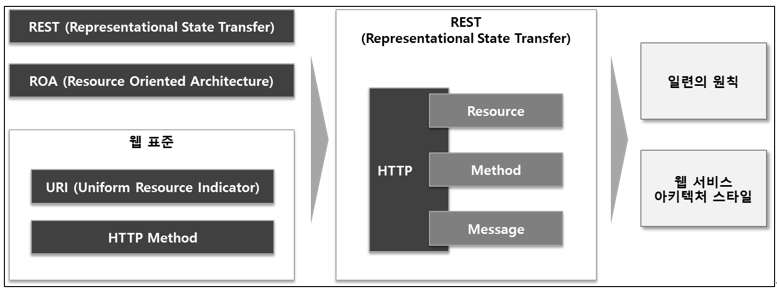
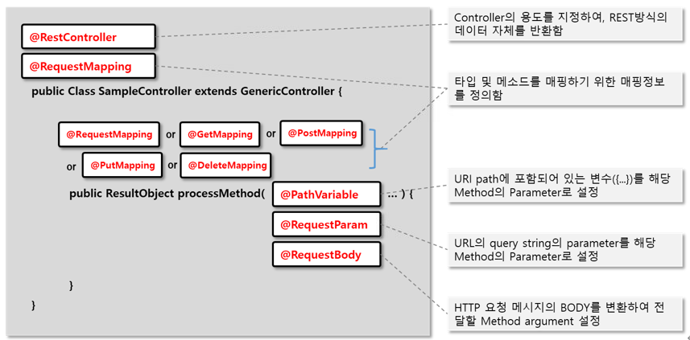

# API URI 작성 가이드
> API URI 설계에서 가장 중요한 것은 리소스(Resource)를 식별하는 것 입니다.<Br>
> HTTP 메서드와 특징, 이를 기반으로 한 API 설계가 되어야 합니다.<Br>
> 본 가이드는 API URI 의 표준을 정의하며, 이를 통해 URI만 보고 자원 및 동작 파악이 가능하고 일관성과 명확성을 향상시킵니다.

---
## 목차
1. [API 표준](#1-API-표준)  

2. [구성 요소](#2-구성-요소)  
   2.1 [자원(Resource): URI](#21-자원resource-uri)   
   2.2 [행위(Verb): HTTP Method](#22-행위verb-http-method)  
   2.3 [메시지(Message): 내용](#23-메시지message-내용) 

3. [기본 구조 및 역할](#3-기본-구조-및-역할)

4. [URI 작성 표준](#4-URI-작성-표준)


--- 
## **1. API 표준**
- Open API 는 일반적인 REST API 기준으로 따르고 있으며, REST(Representational State Transfer)는
ROA(Resource Oriented Architecture)를 따르는 웹 서비스 아키텍처 스타일 이다.
- URI 와 HTTP Method 와 같은 웹 표준을 통해 객체화된 서비스에 어떻게 사용되어야 하는지에 대한 일련의 원칙을 정의 한다.
- 즉, REST 는 어떤 자원(Resource)에 어떤 행위(Method)를 어떻게(Message) 할지를 HTTP 기반으로 전행 놓은 아키텍처 스타일 이다. <br>


--- 
## **2. 구성 요소**
- Open API(REST API) 구성은 크게 **Resource(자원), Method(행위), Message(내용)** 과 같다.

--- 
### 2.1 자원(Resource): URI
- 접근할 자원(URI)를 정의하며, URI 는 자원을 표현하는데 집중 한다.
- 모든 자원은 고유한 ID가 존재하고, 이 자원은 Server 에 존재 한다.
- 자원을 구별하는 ID는 '/books/1' 와 같은 HTTP URI 이다.
- Client 는 URI 를 이용해서 자원을 지정하고, 해당 자원의 상태(정보)에 대한 조작을 Server 에 요청 한다.
<br><예시>

   | URI                                   | 의미                 |
   |---------------------------------------|--------------------|
   | https://api.domain.com/codes          | 코드 정보 Collection   |
   | https://api.domain.com/codes/100      | 100번 코드 정보         |
   | https://api.domain.com/codes/100/name | 100번 코드의 명칭        |

---
### 2.2 행위(Verb): HTTP Method
- 자원에 대한 처리 행위를 정의 한다.
- 행위에 대한 정의는 **HTTP METHOD 를 통해 표현** 한다.
- HTTP 프로토콜의 Method 를 사용 한다.
- HTTP 프로토콜은 **GET, POST, PUT, PATCH, DELETE** 와 같은 메서드를 제공 한다.
  - `GET`: 리소스 조회
  - `POST`: 요청 데이터 처리, 주로 등록에 사용
  - `PUT`: 리소스를 대체, 해당 리소스가 없으면 생성
  - `PATCH`: 리소스 부분 변경
  - `DELETE`: 리소스 삭제

---
### 2.3 메시지(Message): 내용
- 자원에 대한 처리 행위의 내용(Payload)을 정의 한다.
<br><예시>

   | Item        | Description                | Remark                                                                                                                                                                                                                                                                                                                                               |
   |-------------|----------------------------|------------------------------------------------------------------------------------------------------------------------------------------------------------------------------------------------------------------------------------------------------------------------------------------------------------------------------------------------------|
   | HTTP Header | Body의 Content Type을 명시 한다  | Content-type: application/json<br/>Accept.application/json                                                                                                                                                                                                                                                                                           |
   | HTTP Body   | Body에 포함된 데이터를 통해 정보를 전달 한다 | JSON 포멧 사용                                                                                                                                                                                                                                                                                                                                           |
   | Status Code | 리소스 요청에 대한 응답 상태를 나타 낸다    | 200: 정상<br/>201: Request가 처리되었고, 새로운 자원 생성이 됨을 의미<br/>202: Request가 수락되었으나, Response메시지를 전달할 때까지 해당 프로세스가 완료되지 못한 경우<br/>204: Request처리 했지만, Client에게 전달할 새로운 정보가 없는 경우<br/>400: 잘못된 요청인 경우<br/>401: Request가 User 인증이 필요함을 Client에게 알려주기 위해 사용<br/>403: Request가 거절됨<br/>404: URI에 해당하는 자원을 찾을 수 없는 경우<br/>500: 서버에 예기치 않은 오류로 Request를 처리할 수 없는 경우 |

--- 
## **3. 기본 구조 및 역할**
- REST API 원칙을 따르는 Controller Class 및 Method 의 기본 구조와 역할은 다음과 같다.<br>
  
- REST API 를 표현하는 URL 의 기본 형식은 다음과 같으며, 업무영역(서비스) 및 모듈구분(단위 서비스)은 프로젝트 성격에 맞게 재정의하여 사용하면 된다.
  <br><예시>
  ```
      http(s)://[Domain Name]/[Part Area]/[Module]/[Resource Path]/[Path Variable]/?[Query String]
  ```  

  | Attribute   | Description                              | Example                                                                    |
  |-------------|------------------------------------------|----------------------------------------------------------------------------|
  | Domain Name | 도메인 주소                                   | http(s)://<b>www.api-domain.com</b>                                        |
  | Part Area   | 업무영역(서비스) 구분 식별명                         | http(s)://www.api-domain.com/<b>common</b>                                 |
  | Module      | 단위 업무영역(단위 서비스) 구분 식별명                   | http(s)://www.api-domain.com/common/<b>code</b>                            |
  | Resource Path | API 기능 제공을 위해 필요한 식별자                    | http(s)://www.api-domain.com/common/code/<b>categories</b>                 |
  | Path Variable  | API 기능 제공을 위해 필요한 parameter              | http(s)://www.api-domain.com/common/code/categories/<b>{categoryId}</b>    |
  | Query String   | API 기능 제공을 위해 보조적인 parameter 가 필요한 경우 사용 | http(s)://www.api-domain.com/common/code/categories<b>?limit=10&offset=1</b> |

---
## **4. URI 작성 표준**
- 모든 Resource 는 유일한 URI 로 정의 한다.
- HTTP 메서드와 URI 의 역할은 일치해야 한다.

  | HTTP Method | 역할        | 예제 URI          | 설명          |
  |-------------|-----------|-----------------|-------------|
  | GET         | 조회        | `/users`        | 사용자 목록 조회   |
  | GET         | 단건 조회     | `/users/1`      | 특정 사용자 조회   |
  | POST        | 생성        | `/users`        | 사용자 생성      |
  | PUT         | 수정        | `/users/1`      | 특정 사용자 수정   |
  | PATCH       | 부분 수정     | `/users/1`      | 특정 사용자 일부 수정 |
  | DELETE      | 삭제        | `/users/1`      | 특정 사용자 삭제   |

- URI 는 슬래시(`/`)로 hierarchical 하도록 구성 한다. <br> (상위 → 하위 관계는 `/`로 구분하며, 상위 경로는 하위 경로의 집합을 의미하는 단어로 구성)
  ```java
      GET /users/1/orders         // 특정 사용자의 주문 조회
      GET /products/1/reviews     // 특정 상품의 리뷰 조회
  ```
- Resource 는 동사 대신 명사로 표현해야 하며 행위가 URI 표현으로 들어가지 않도록 한다. <br> (CRUD 동작은 HTTP 메소드로 표현하므로..)
  
  <예제>
  ```java
      GET /users          // 사용자 목록 조회
      GET /users/1        // 특정 사용자 조회
      POST /users         // 사용자 생성
      PUT /users/1        // 특정 사용자 수정
      DELETE /users/1     // 특정 사용자 삭제
  ```  
  
  <잘못된 예제>
  ```java
      GET /getUsers         // 동사 사용 금지  
      POST /createUser      // 동사 사용 금지
  ```  
- URI 는 소문자로 작성해야 한다. <br> (대/소문자에 따라서 서로 다른 Resource 로 인식되어 혼란을 줄수 있음)

  <예제>
  ```java
      GET /users          // 소문자 사용
  ```  

  <잘못된 예제>
  ```java
      GET /Users         // 대문자 사용 금지
  ```  
- URI 는 확장자를 사용하지 않도록 한다. <br> (RESTful API 응답 포멧은 HTTP Header의 `Content-Type`으로 결정되므로 `.json`, `.xml` 같은 확장자는 사용하지 않음)
  ```java
      GET /users/1.json   // 확장자 사용 금지
  ```
- Collection 을 나타내는 경우 복수로 표현 한다.
  ```java
      GET /products        // 상품 목록 조회
      GET /orders          // 주문 목록 조회
  ```
- 언더스코어(`_`) 대신 하이픈(`-`)을 사용 한다.

  <예제>
  ```java
      GET /product-reviews   // 하이픈 사용
  ```  

  <잘못된 예제>
  ```java
      GET /product_reviews   // 언더스코어 사용 금지
  ```
- 필터링 및 정렬은 `Query Parameter` 를 사용 한다.

  <예제>
  ```java
      GET /products?category=shoes&color=red&sort=price
  ```  

  <잘못된 예제>
  ```java
      GET /products/category/shoes/color/red/sort/price   // 쿼리 파라미터로 처리해야 함
  ```  
- URL 인코딩이 필요한 문자는 사용하지 않는다.
- URI 마지막 문자는 슬래시(`/`)를 포함하지 않는다.
- 가능하면 짧고 의미가 있는 단어로 표현하여 URI 만으로 직관적으로 이해할 수 있도록 한다.

---
