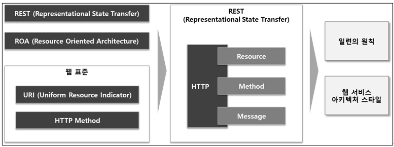

# API URI Writing Guide
> The most important aspect of API URI design is identifying resources.<Br>
> API design should be based on HTTP methods and their characteristics.<Br>
> This guide defines standards for API URIs, enabling resource and action identification through URI alone, enhancing consistency and clarity.

---
## Table of Contents
1. [API Standards](#1-api-standards)  

2. [Components](#2-components)  
   2.1 [Resource: URI](#21-resource-uri)   
   2.2 [Verb: HTTP Method](#22-verb-http-method)  
   2.3 [Message: Content](#23-message-content) 

3. [Basic Structure and Roles](#3-basic-structure-and-roles)

4. [URI Writing Standards](#4-uri-writing-standards)


--- 
## **1. API Standards**
- Open API follows general REST API standards, where REST (Representational State Transfer) is
a web service architecture style that follows ROA (Resource Oriented Architecture).
- It defines a series of principles on how to use objectified services through web standards such as URI and HTTP Method.
- In other words, REST is an architecture style that completely defines how to perform what actions (Method) on what resources (Resource) based on HTTP. <br>


--- 
## **2. Components**
- Open API (REST API) composition consists mainly of **Resource, Method, and Message**.

--- 
### 2.1 Resource: URI
- Defines the resource (URI) to access, focusing on expressing resources through URI.
- All resources have unique IDs and exist on the Server.
- The ID that distinguishes resources is an HTTP URI like '/books/1'.
- The Client specifies resources using URI and requests the Server to manipulate the resource's state (information).
<br>**<Example>**

   | URI                                   | Meaning                |
   |---------------------------------------|------------------------|
   | https://api.domain.com/codes          | Code Collection        |
   | https://api.domain.com/codes/100      | Code #100 Information |
   | https://api.domain.com/codes/100/name | Name of Code #100     |

---
### 2.2 Verb: HTTP Method
- Defines processing actions for resources.
- Actions are **expressed through HTTP METHODS**.
- Uses HTTP protocol Methods.
- HTTP protocol provides methods such as **GET, POST, PUT, PATCH, DELETE**.
  - `GET`: Retrieve resource
  - `POST`: Process request data, mainly used for registration
  - `PUT`: Replace resource, create if not exists
  - `PATCH`: Partial resource modification
  - `DELETE`: Delete resource

---
### 2.3 Message: Content
- Defines the content (Payload) of processing actions for resources.
<br>**<Example>**

   | Item        | Description                | Remark                                                                                                                                                                                                                                                                                                                                               |
   |-------------|----------------------------|------------------------------------------------------------------------------------------------------------------------------------------------------------------------------------------------------------------------------------------------------------------------------------------------------------------------------------------------------|
   | HTTP Header | Specifies Body's Content Type  | Content-type: application/json<br/>Accept.application/json                                                                                                                                                                                                                                                                                           |
   | HTTP Body   | Transmits information through data in Body | Uses JSON format                                                                                                                                                                                                                                                                                                                                           |
   | Status Code | Indicates response status for resource request    | 200: Success<br/>201: Request processed and new resource created<br/>202: Request accepted but process not completed when response message is sent<br/>204: Request processed but no new information to send to Client<br/>400: Bad request<br/>401: Used to inform Client that User authentication is required<br/>403: Request rejected<br/>404: Resource not found for URI<br/>500: Server cannot process request due to unexpected error |

--- 
## **3. Basic Structure and Roles**
- The basic structure and roles of Controller Class and Method following REST API principles are as follows.<br>
  
- The basic format of URLs expressing REST API is as follows, and business area (service) and module division (unit service) can be redefined according to project characteristics.
  <br>**<Example>**
  ```
      http(s)://[Domain Name]/[Part Area]/[Module]/[Resource Path]/[Path Variable]/?[Query String]
  ```  

  | Attribute   | Description                              | Example                                                                      |
  |-------------|------------------------------------------|------------------------------------------------------------------------------|
  | Domain Name | Domain address                                   | http(s)://<b>www.api-domain.com</b>                                          |
  | Part Area   | Business area (service) division identifier                         | http(s)://www.api-domain.com/<b>common</b>                                   |
  | Module      | Unit business area (unit service) division identifier                   | http(s)://www.api-domain.com/common/<b>code</b>                              |
  | Resource Path | Identifier required for API functionality                    | http(s)://www.api-domain.com/common/code/<b>categories</b>                   |
  | Path Variable  | Parameter required for API functionality              | http(s)://www.api-domain.com/common/code/categories/<b>{categoryId}</b>      |
  | Query String   | Used when auxiliary parameters are needed for API functionality | http(s)://www.api-domain.com/common/code/categories<b>?limit=10&offset=1</b> |

---
## **4. URI Writing Standards**
- All Resources must be defined with unique URIs.
- HTTP method and URI roles must match.

  | HTTP Method | Role        | Example URI          | Description          |
  |-------------|-----------|-----------------|-------------|
  | GET         | Retrieve        | `/users`        | List users   |
  | GET         | Single Retrieve     | `/users/1`      | Get specific user   |
  | POST        | Create        | `/users`        | Create user      |
  | PUT         | Update        | `/users/1`      | Update specific user   |
  | PATCH       | Partial Update     | `/users/1`      | Partially update specific user |
  | DELETE      | Delete        | `/users/1`      | Delete specific user   |

- URIs should be hierarchical using slashes(`/`). <br> (Parent → child relationship is separated by `/`, and parent path consists of words meaning collection of child paths)
  ```java
      GET /users/1/orders         // Retrieve orders for specific user
      GET /products/1/reviews     // Retrieve reviews for specific product
  ```
- Resources should be expressed as nouns, not verbs, and actions should not be included in URI expression. <br> (CRUD actions are expressed through HTTP methods..)
  
  **<Example>**
  ```java
      GET /users          // List users
      GET /users/1        // Get specific user
      POST /users         // Create user
      PUT /users/1        // Update specific user
      DELETE /users/1     // Delete specific user
  ```  
  
  **<Incorrect Example>**
  ```java
      GET /getUsers         // No verbs allowed  
      POST /createUser      // No verbs allowed
  ```  
- URIs should be written in lowercase. <br> (Different cases can be recognized as different Resources, causing confusion)

  **<Example>**
  ```java
      GET /users          // Use lowercase
  ```  

  **<Incorrect Example>**
  ```java
      GET /Users         // No uppercase allowed
  ```  
- URIs should not use file extensions. <br> (RESTful API response format is determined by HTTP Header's `Content-Type`, so extensions like `.json`, `.xml` should not be used)
  ```java
      GET /users/1.json   // No extensions allowed
  ```
- Collections should be expressed in plural form.
  ```java
      GET /products        // List products
      GET /orders          // List orders
  ```
- Use hyphens(`-`) instead of underscores(`_`).

  **<Example>**
  ```java
      GET /product-reviews   // Use hyphens
  ```  

  **<Incorrect Example>**
  ```java
      GET /product_reviews   // No underscores allowed
  ```
- Use `Query Parameter` for filtering and sorting.

  **<Example>**
  ```java
      GET /products?category=shoes&color=red&sort=price
  ```  

  **<Incorrect Example>**
  ```java
      GET /products/category/shoes/color/red/sort/price   // Should use query parameters
  ```  
- Do not use characters that require URL encoding.
- URI should not end with a slash(`/`).
- Use short, meaningful words to make URIs intuitively understandable.

--- 