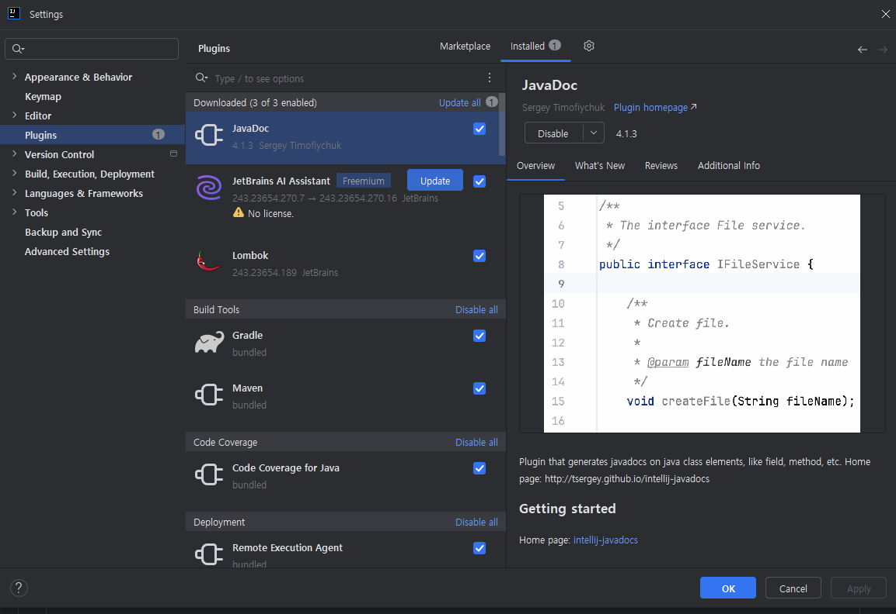
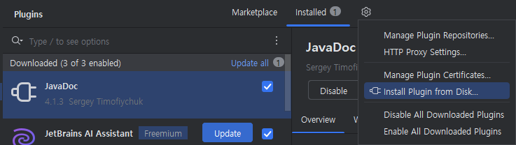
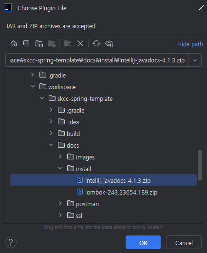
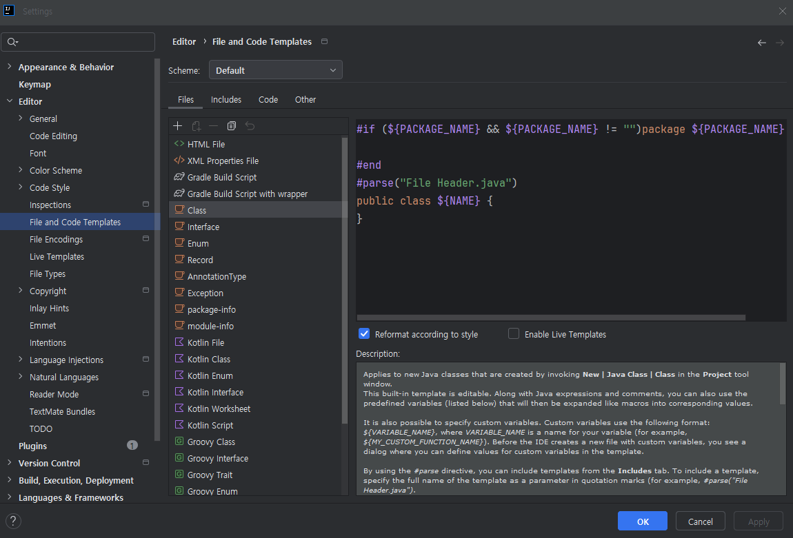
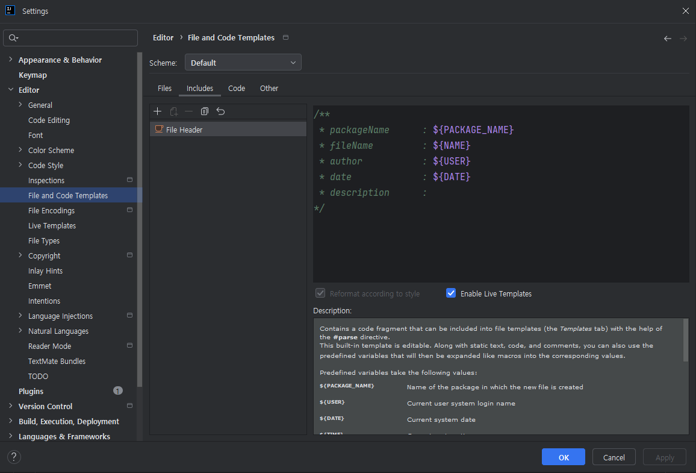
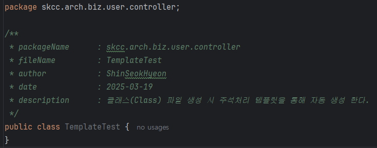
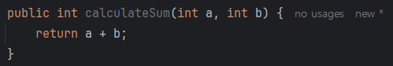
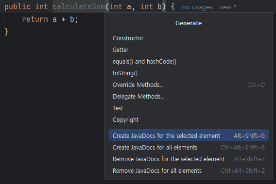
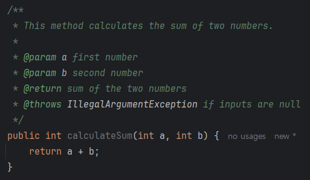

# Java 기본 코딩 가이드
>
> 본 코딩 가이드는 Java 코드를 작성할 때 규격성을 유지하면서 읽기 쉽고 관리하기 쉬운 코드를 작성하기 위해 기본적인 스타일과 규칙을 제공합니다.
---

## 목차

1. [기본 스타일](#기본-스타일)
    - [라인 길이](#라인-길이)
    - [들여쓰기](#들여쓰기)
    - [공백](#공백)
2. [Statement 작성](#statement-작성)
    - [`if`문 작성](#if문-작성)
    - [`for`문 작성](#for문-작성)
    - [`while`문 작성](#while문-작성)
    - [`do-while`문 작성](#do-while문-작성)
    - [`try-catch` 문](#try-catch-문)
    - [`try-with-resources` 문](#try-with-resources-문)
    - [`try-catch-finally` 문](#try-catch-finally-문)
    - [`switch`문 작성 가이드](#switch문-작성-가이드)  
3. [변수 선언](#변수-선언)
    - [상수 (`static final`)](#상수-static-final)
4. [주석 작성](#주석-작성)
    - [주석 스타일](#주석-스타일)
    - [Code Template 및 Javadoc 사용](#code-template-및-javadoc-사용)
    - [클래스/메서드 설명](#클래스/메서드-설명)
    - [라인 설명](#라인-설명)
    - [TODO 주석](#todo-주석)

---

## 기본 스타일

### 라인 길이

- **모든 줄은 120자 이내**로 작성한다.
  - 만약 한 줄에서 코드나 문장이 초과될 경우, 다음 줄로 **개행**하고 논리적으로 분리한다.
  - **연산자**는 개행 시 다음 줄의 첫 부분에 위치시킨다.

      ```java
      if (longCondition && anotherCondition 
          || additionalCondition) {
          performAction();
      }
      ```

### 들여쓰기

- **4칸 스페이스**를 기본 들여쓰기로 사용한다.
- Tab 대신 **Space** 사용 권장.
- 블록은 중괄호(`{` `}`)를 항상 사용하며, 여는 중괄호는 **같은 행**에, 닫는 중괄호는 **줄바꿈 후 작성한다**.

  ```java
  if (condition) {
      // 작업 수행
  } else {
      // 다른 작업 수행
  }
  ```

### 공백

- 연산자(=``, `+`, `-`, 등)의 양쪽에 한 칸의 공백을 둔다.

  ```java
  int value = a + b;
  ```

- 매개변수 리스트 내 쉼표 뒤에는 **쉼표 + 한 칸의 공백**을 둔다.

  ```java
  method(arg1, arg2, arg3);
  ```

- 긴 메서드 체이닝은 점(`.`) 앞에서 줄바꿈을 한다.

  ```java
  builder.methodOne().methodTwo()
         .methodThree();
  ```

---

## Statement 작성

Java에서 `if`, `for`, `while`, `try~catch`, `switch` 등의 제어문을 작성할 때, 가독성과 유지보수를 고려하여 작성하는 방법을 정리합니다.

### `if`문 작성

- 모든 `if` 블록은 항상 **중괄호(`{}`)**를 사용한다. 단일 행의 코드를 작성하더라도 중괄호를 생략하지 않는다.
- 조건문은 가능하면 **명확하고 간결**하게 작성하며, 불필요한 중첩 조건을 피한다.
- **Negation (부정)** 조건을 사용하는 대신, 가능한 긍정 조건으로 표현한다.

#### 기본 형식

```java
if (condition) {
    // 조건이 true일 경우 실행되는 코드
} else if (anotherCondition) {
    // 두 번째 조건이 true일 경우 실행되는 코드
} else {
    // 모든 조건이 false일 경우 실행되는 코드
}
```

#### 예시: 부정 조건을 긍정 조건으로 변경

- **권장하지 않는 방식**

    ```java
    if (!isValid) {
      return;
    }
    ```

- **권장 방식 (긍정 조건 사용)**

    ```java
    if (isValid) {
      // 작업 수행
    } else {
      return;
    }
    ```

#### 다중 조건문 사용

- 다중 조건이 있는 경우, 조건은 **논리 연산자 순서**(`&&`, `||`)에 따라 명확히 구분한다.
- 길어진 조건문은 개행을 통해 **가독성을 향상**시킨다.

  ```java
  if (user != null && user.isActive() && (isAdmin || hasPermission)) {
      performAction();
  }
  ```

#### 한 줄의 조건 처리

- 가능하면 **한 줄의 조건문**은 피하고, 블록을 명확히 작성한다.
- **권장하지 않는 방식**:

    ```java
    if (condition) performAction();
    ```

- **권장 방식**:

  ```java
  if (condition) {
      performAction();
  }
  ```

---

### `for`문 작성

- 반복문은 **명확한 범위**를 지정하며, 반복 횟수를 알 수 있을 경우 **`for`문**을 사용하는 것을 권장한다.
- 반복문의 조건식을 단순하고 명확히 작성한다.
- 반복문의 변수(i, j 등)는 항상 **의미 있는 이름**을 사용하는 것을 권장하며, 간단한 경우에는 `i`, `j` 등의 단순 이름 사용을 허용한다.

    ```java
    for (int i = 0; i < items.size(); i++) {
      System.out.println(items.get(i));
    }
    ```

#### 향상된 `for-each` 문

- 컬렉션이나 배열을 순회할 경우, **향상된 `for`문**을 사용하는 것을 권장한다.

    ```java
    for (String item : items) {
      System.out.println(item);
    }
    ```

#### 다중 반복문 작성

- 다중 반복문은 **내부 반복문의 가독성**을 유지하도록 작성한다.
- 중첩 반복문의 경우, 복잡도를 줄이기 위해 **메서드 분리**를 고려한다.

    ```java
    for (int i = 0; i < rows; i++) {
      for (int j = 0; j < columns; j++) {
          System.out.println("Processing cell: " + i + ", " + j);
      }
    }
    ```

#### 반복문에서 조건문 사용

```java
for (String item : items) {
    if (item.startsWith("A")) {
        System.out.println("Item starts with A: " + item);
    }
}
```

---

### `while`문 작성

- 반복 횟수가 정해져 있지 않고 **조건에 따라 반복**이 결정될 때는 `while`문을 사용한다.
- 조건문은 가능하면 간결하게 작성하고, 반복문 조건이 항상 **true로 유지되는 경우(무한 루프)** 종료 조건이 반드시 포함되도록 한다.

#### 기본 형식

```java
while (condition) {
    // 조건이 true일 동안 실행되는 코드
}
```

#### 예시: 조건에 따라 자원을 계속 읽는 경우

```java
while ((line = reader.readLine()) != null) {
    System.out.println(line);
}
```

#### 무한 루프 작성과 종료 조건 처리

- 무한 루프는 반드시 종료 조건을 명확히 작성한다.
- **권장하지 않는 방식 (종료 조건 명확하지 않음)**:

    ```java
    while (true) {
      // 작업 수행
    }
    ```

- **권장 방식 (종료 조건 명확)**:

    ```java
    while (shouldContinue) {
      performAction();
      if (conditionMet) {
          shouldContinue = false;
      }
    }
    ```

---

### `do-while`문 작성

- **최소 한 번 실행이 보장**되어야 할 경우 `do-while`문을 사용한다.
- 조건은 루프의 끝에 위치하며 명확하게 작성한다.

#### 기본 형식

```java
do {
    // 실행할 코드
} while (condition);
```

#### 예시: 사용자 입력 대기

```java
String input;
do {
    input = scanner.nextLine();
    System.out.println("You entered: " + input);
} while (!"exit".equals(input));
```

---

### `try-catch` 문 (중요)

- **예외 처리**는 반드시 필요한 경우에만 작성하며, 무의미한 예외 남발을 피한다.
- `try-catch` 블록은 반응 논리가 명확하고 적절한 방식으로 작성되도록 신경 쓴다.
- 예외 사항(특히 `catch`)은 절대로 **빈 블록으로 두어서는 안 된다**.

#### 표준 `try-catch` 작성 규칙

- 예외가 발생한 상황을 로깅(`logging`)하거나, 사용자에게 알림을 주며, 설계된 방식으로 복구해야 한다.
- 명확한 예외(Exception) 이름을 사용하여 필요한 예외만 **구체적으로 처리**한다.

    ```java
    try {
      resource.open();
      performOperation();
    } catch (IOException e) {
      log.error("Failed to perform operation: {}", e.getMessage(), e);
      throw new CustomException("An error occurred while processing the operation", e);
    }
    ```

---

### `try-with-resources` 문

- 자원을 다룰 때(`InputStream`, `OutputStream`, `Reader`, `Writer`, `Socket`, `Database Connection` 등) **필수적으로
  `try-with-resources`**를 사용한다.
- `try-with-resources`는 **자원을 명시적으로 닫을 필요가 없도록 자동으로 관리**하므로 코드 가독성과 안정성을 향상시킨다.

#### 예시: 단일 자원 처리

- 자원은 `try` 선언부에서 생성하며, 블록이 끝날 때 **자동으로 닫힌다**.

    ```java
    try (BufferedReader reader = new BufferedReader(new FileReader("file.txt"))) {
      String line = reader.readLine();
      System.out.println(line);
    } catch (IOException e) {
      log.error("File read error: {}", e.getMessage(), e);
    }
    ```

#### 예시: 다중 자원 처리

- 여러 자원을 사용할 경우 한 줄에 콤마(`,`)로 나열한다.

    ```java
    try (
      Connection connection = dataSource.getConnection();
      PreparedStatement statement = connection.prepareStatement("SELECT * FROM users");
      ResultSet resultSet = statement.executeQuery()
    ) {
      while (resultSet.next()) {
          System.out.println("User ID: " + resultSet.getInt("id"));
      }
    } catch (SQLException e) {
      log.error("Database error: {}", e.getMessage(), e);
    }
    ```

#### 특징 및 사용 규칙

1. **Closable 자원**(예: `java.lang.AutoCloseable` 인터페이스 구현체)만 `try-with-resources`에 사용 가능하다.
2. 자원 사용 시 **불필요한 `close()` 호출을 피하고** 블록 종료 시 자동으로 닫히도록 맡긴다.
3. 모든 자원은 **`null`이 아닌 적절한 객체**로 초기화해야 한다.

---

### `try-catch-finally` 문

- 필요에 따라 `finally` 블록을 사용할 수도 있다. 주로 `try-with-resources` 사용이 적합하지 않은 상황에서 사용한다.
- 자원 해제, 로그 출력 등 **반드시 실행되어야 하는 작업**에 적합하다.
- 단, 자원의 해제 작업은 `try-with-resources`로 대체 가능하다.

- 예시: `try-catch-finally` 사용

    ```java
    FileInputStream fileStream = null;
    try {
        fileStream = new FileInputStream("file.txt");
        byte[] data = fileStream.readAllBytes();
            System.out.println(new String(data));
    } catch (IOException e) {
        log.error("Error reading file: {}", e.getMessage(), e);
    } finally {
        if (fileStream != null) {
            try {
                fileStream.close();
            } catch (IOException e) {
                log.error("Failed to close file stream: {}", e.getMessage(), e);
            }
        }
    }
    ```

#### 권장: `try-with-resources`로 대체

- 위 코드는 아래처럼 간결하게 표현 가능하다:

    ```java
    try (FileInputStream fileStream = new FileInputStream("file.txt")) {
        byte[] data = fileStream.readAllBytes();
        System.out.println(new String(data));
    } catch (IOException e) {
        log.error("Error reading file: {}", e.getMessage(), e);
    }
    ```

### `switch`문 작성 가이드

Java의 `switch`문은 기본적으로 특정 조건에 따라 코드의 실행을 분기하는 데 사용되며, Java 14부터 **`switch` 표현식**이 추가되어 더 간결하고 명확한 코드를 작성할 수 있습니다. 본 가이드는 전통적인 `switch`문부터 최신 `switch` 표현식까지의 스타일을 다룹니다.

#### 1. `switch`문의 기본 작성 규칙

- **모든 `case` 블록은 중괄호 없이 `:` 뒤에 간결하고 명확하게 작성한다.**
  - 여러 줄 코드가 필요한 경우, `break`, `return`, 또는 `throw`로 명확히 종료 처리한다.
- `default` 블록은 반드시 추가하며, 누락된 조건 처리에 대한 방어 로직을 작성한다.
- 값(문자열, 열거형, 숫자 등)의 범위가 명확할 경우 **`switch`**는 `if-else`보다 사용을 선호한다.

#### 기본 예시

```java
switch (day) {
    case "MONDAY":
        System.out.println("Start of the work week");
        break;
    case "FRIDAY":
        System.out.println("Last day before the weekend!");
        break;
    case "SATURDAY":
    case "SUNDAY":
        System.out.println("Weekend!");
        break;
    default:
        System.out.println("Midweek blues!");
}
```

#### 2. `switch` 표현식(Switch Expressions)

- Java 14+부터 도입된 **`switch` 표현식**은 `break` 없이 한 줄로 반환값을 처리할 수 있어 가독성이 좋아진다.
- 화살표(`->`)를 사용하여 간략화된 구문을 제공한다.
- 단일 `case`에서 여러 값을 분기할 수 있다.

#### 특징

1. **값 반환이 가능**: `switch` 표현식은 값을 **`return`, `yield`** 형태로 반환할 수 있다.
2. `case`가 끝났을 때 **자동 종료**되므로 `break` 필요 없음.
3. 코드가 간결하고 선언적으로 표현되며 함수형 프로그래밍 스타일을 따를 수 있다.

#### 예시: 간단한 `switch` 표현식

```java
String dayType = switch (day) {
    case "SATURDAY", "SUNDAY" -> "Weekend";
    case "MONDAY" -> "Start of the work week";
    case "FRIDAY" -> "Almost Weekend!";
    default -> "Midweek";
};
System.out.println(dayType);
```

#### 예시: 블록 구문 사용

- 여러 줄 블록으로 명확한 로직 처리 후 값 반환 시 `yield`를 사용한다.

    ```java
    String dayType = switch (day) {
        case "SATURDAY", "SUNDAY" -> {
            System.out.println("It's the weekend!");
            yield "Weekend";
        }
        case "MONDAY" -> {
            System.out.println("Time to work.");
            yield "Start of the work week";
        }
        default -> {
            System.out.println("A regular weekday.");
            yield "Midweek";
        }
    };
    System.out.println(dayType);
    ```

#### 3. 패턴 매칭(Pattern Matching)과 `switch`

Java 17부터는 **패턴 매칭**이 `switch`문에 도입되어 더욱 강력한 분기 처리가 가능해졌습니다. 이는 변수의 타입에 따라 분기하거나, 조건부 처리를 위한 추가적인 검사와 결합할 수 있습니다.

#### 예시: `instanceof`와 연동된 `switch`

```java
Object obj = getSomeObject();
String result = switch (obj) {
    case String s -> "String value: " + s;
    case Integer i -> "Integer value: " + i;
    case null -> "Null value!";
    default -> "Unknown type";
};
System.out.println(result);
```

#### 예시: 조건부 패턴  

조건부 패턴은 `case` 조건을 추가적으로 검사하여 더 세밀한 처리를 허용한다.  

```java
int result = switch (number) {
    case 0 -> 0; // Base case
    case Integer n && n > 0 -> n * 2; // Positive numbers
    case Integer n && n < 0 -> -n; // Negative numbers
    default -> throw new IllegalArgumentException("Unexpected value: " + number);
};
```

#### 4. 가독성을 위한 스타일 가이드

1. **단순한 `case`들은 화살표(`->`) 표현식 사용**을 권장한다.  
  단일 행 처리가 적합한 경우 사용.

    ```java
    String result = switch (value) {
       case 1 -> "One";
       case 2, 3 -> "Two or Three";
       default -> "Other";
    };
    ```
  
2. **다중 조건을 처리하는 경우 `블록 처리`와 주석 사용**.

    ```java
    String result = switch (grade) {
       case "A" -> {
           // Excellent
           System.out.println("Great job!");
           yield "Passed with Distinction";
       }
       case "B", "C" -> {
           // Above average
           System.out.println("Good effort!");
           yield "Passed";
       }
       case "D" -> {
           // Below average
           yield "Passed conditionally";
       }
       default -> {
           System.out.println("Failed.");
           yield "Failed";
       }
    };
    ```

3. `default` 절은 빠짐없이 작성하되, 반드시 **예외 처리**나 기본값을 제공한다.

4. **`switch` 표현식을 사용하면 더 선언적이고 유지보수에 용이**하므로 가능한 경우 권장한다.

---

#### 5. 전통적인 `switch`문과 표현식 비교

| **기능**                    | **전통적인 `switch`문**                                            | **`switch` 표현식**                        |
|-----------------------------|------------------------------------------------------------------|-------------------------------------------|
| **결과 반환**                | 불가능                                                          | 가능 (값을 반환하고 변수에 할당 가능)      |
| **구문 종료**                | `break` 필수                                                   | 자동으로 종료                              |
| **다중 조건 처리**           | 중복 `case` 작성 필요                                           | 쉼표로 조건 간소화 가능                     |
| **블록 처리**                | 명령문 블록 직접 추가                                           | 블록 처리 가능, 값은 `yield`로 반환        |
| **도입 버전(최소 요구사항)** | 모든 Java 버전 지원                                             | Java 14+ (`switch` 표현식), Java 17+ (패턴 매칭) |

#### 6. 권장 사용 사례

1. **값 반환이 필요한 경우**: 가능한 경우 `switch` 표현식을 통해 값 반환 및 간결한 구문을 작성한다.

    ```java
    String status = switch (orderStatus) {
        case "PENDING" -> "Order is pending";
        case "COMPLETED" -> "Order completed";
        default -> "Unknown status";
    };
    ```

2. **패턴 기반 분기 처리**: 다양한 조건 및 타입을 처리해야 할 경우 `switch` 패턴을 적용한다.

   ```java
   String description = switch (object) {
       case String s -> "It is a string: " + s;
       case Integer i -> "It is an integer: " + i;
       case null -> "This is null";
       default -> "Unknown type";
   };
   ```

3. 전통적인 `switch`문은 단순한 분기 처리 또는 종속성이 있거나 다른 언어 인터페이스에서 필요로 할 경우에만 사용하고, 유지보수성이 중요한 코드에서는 `switch` 표현식을 활용한다.

---

## 변수 선언

- 변수를 선언할 때 **명확하고 직관적인 이름**을 사용하며, 약어 사용을 지양한다.
- 변수는 **CamelCase**를 따른다.

  ```java
  int itemCount = 10;
  String firstName = "John";
  ```

- 클래스 내 변수 선언 순서:
    1. `static final` 상수
    2. `static` 변수
    3. 인스턴스 변수
    4. 지역 변수

### 상수 (`static final`)

- 상수는 반드시 **대문자 스네이크 표기법**을 따른다.

  ```java
  public static final int MAX_CONNECTIONS = 100;
  public static final String ERROR_MESSAGE = "An error occurred";
  ```

- 상수의 값은 **변하지 않는 값**이어야 한다.

---

## 주석 작성

- 코드는 **목적과 의도를 설명하기 위한 주석**을 작성한다.
  - **Why**, **How**를 중심으로 작성하고, *What*은 최대한 코드로 표현되도록 작성

### 주석 스타일
1. **Code Template 및 Javadoc 사용**
    - Javadoc Plugin 설치 방법
        - (사외망) 인텔리제이(intelliJ)의 File > Settings > Plugins 메뉴에서 'JavaDoc' 플러그인 설치
          
        - (폐쇄망) Plugin Setting 이동 (File-Setting 또는 Ctrl+Alt+S) 하여 plugins 영역 클릭<br>
          아래 그림의 톱니 바퀴 클릭 후 Install Plugin from Disk 선택
          <br>
          JavaDoc plugin zip 파일을 선택 (해당 zip 파일은 skcc-spring-template > docs > install 폴더에 위치함)
          <br>

2. **클래스/메서드 설명**
   - 클래스(class)의 주석은 신규 파일 생성 시점에 자동으로 생성 가능
   - 인텔리제이(intelliJ)의 File > Settings > Editor > File and Code Templates 메뉴에서 class 파일을 선택하면<br>
     파일이 생성될 때 자동으로 생성해줄 템플릿 확인 가능하며, 파일 생성시 가장 상단에는 ${PACKAGE_NAME} 치환자를 통해<br>
     패키지명이 자동으로 들어가게 되고 Class명 상단에는#parse("File Header.java") 치환자를 통해 File Header.java 안에<br>
     주석(Comment) 내용이 자동으로 생성
     
   - "File Header.java" 에 치환되는 데이터 설정은 Includes 탭으로 이동하여 다음과 같이 설정
     
        - **클래스(class) 주석은 패키지명, 파일명, 작성자, 작성일, description 을 기본으로 설정 한다.**
          ```java
          /**
           * packageName      : ${PACKAGE_NAME}
           * fileName         : ${NAME}
           * author           : ${USER}
           * date             : ${DATE}
           * description      :
           */
          ```
        - 클래스(class) 주석 자동 생성 예시
          
   - **메서드(method) 주석은 역할, 매개변수 및 반환값, 예외 등을 명확히 설명하고 작성 한다.**
        - Javadoc을 활용한 메소드 주석 작성 예시<br>
          <br>
          메서드 선택 > 오른쪽 마우스키 클릭 > Generate > Create JavaDocs for the selected element 선택하면 해당 메서드에 대한 주석 자동 생성<br>
          
          

          ```java
          /**
           * This method calculates the sum of two numbers.
           *
           * @param a first number
           * @param b second number
           * @return sum of the two numbers
           * @throws IllegalArgumentException if inputs are null
           */
           public int calculateSum(int a, int b) {
              return a + b;
           }
          ```

3. **라인 설명**
    - 특정 코드의 의도나 복잡한 로직을 설명하기 위해 한 줄 주석을 사용한다.

      ```java
      // Get user input from the command line
      Scanner scanner = new Scanner(System.in);
      ```

4. **TODO 주석**
    - 나중에 구현해야 할 작업은 `// TODO`로 명시한다.

      ```java
      // TODO: Implement exception handling for null values
      ```

---
