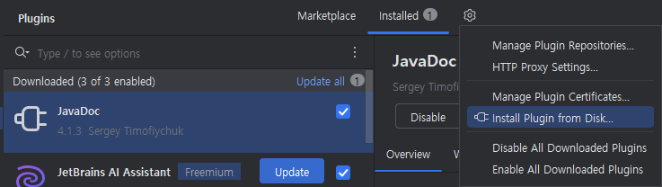
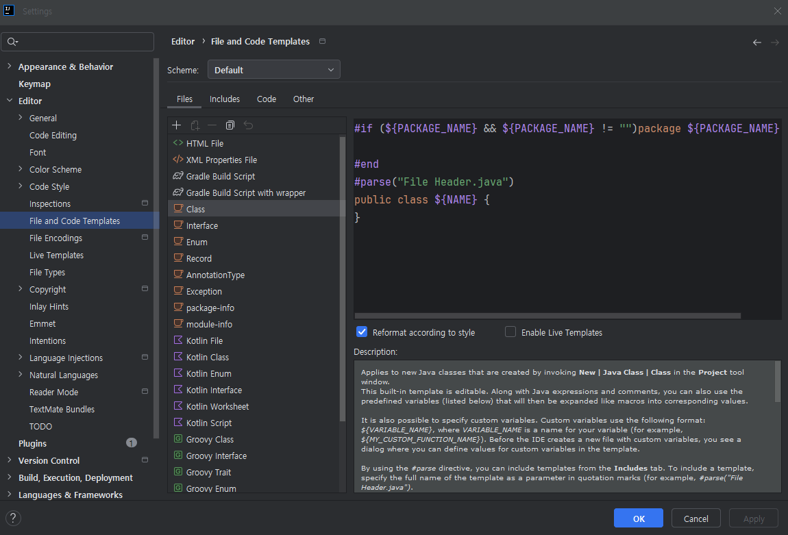
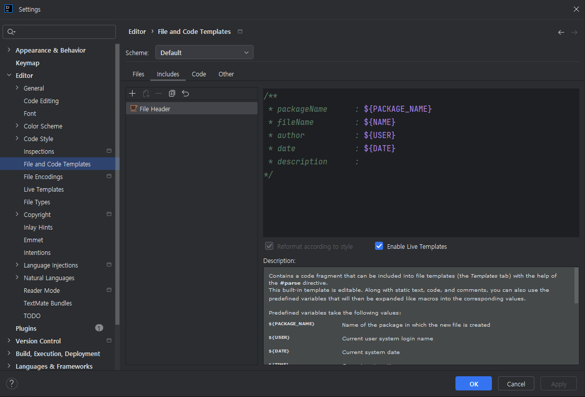
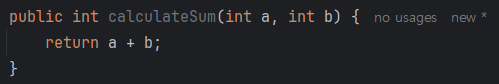

# Java Basic Coding Guide
>
> This coding guide provides basic styles and rules for writing Java code that maintains consistency while being readable and maintainable.
---

## Table of Contents

1. [Basic Style](#basic-style)
    - [Line Length](#line-length)
    - [Indentation](#indentation)
    - [Spacing](#spacing)
2. [Statement Writing](#statement-writing)
    - [`if` Statement](#if-statement)
    - [`for` Statement](#for-statement)
    - [`while` Statement](#while-statement)
    - [`do-while` Statement](#do-while-statement)
    - [`try-catch` Statement](#try-catch-statement)
    - [`try-with-resources` Statement](#try-with-resources-statement)
    - [`try-catch-finally` Statement](#try-catch-finally-statement)
    - [`switch` Statement Guide](#switch-statement-guide)  
3. [Variable Declaration](#variable-declaration)
    - [Constants (`static final`)](#constants-static-final)
4. [Comment Writing](#comment-writing)
    - [Comment Style](#comment-style)
    - [Code Template and Javadoc Usage](#code-template-and-javadoc-usage)
    - [Class/Method Description](#classmethod-description)
    - [Line Description](#line-description)
    - [TODO Comments](#todo-comments)

---

## Basic Style

### Line Length

- **All lines should be within 120 characters**.
  - If code or statements exceed this limit, use **line breaks** and separate logically.
  - Place **operators** at the beginning of the next line when breaking.

      ```java
      if (longCondition && anotherCondition 
          || additionalCondition) {
          performAction();
      }
      ```

### Indentation

- Use **4 spaces** as the basic indentation.
- Use **Space** instead of Tab.
- Always use curly braces(`{` `}`) for blocks, with opening brace on the **same line** and closing brace on a **new line**.

  ```java
  if (condition) {
      // Perform action
  } else {
      // Perform other action
  }
  ```

### Spacing

- Place one space on both sides of operators(=``, `+`, `-`, etc.).

  ```java
  int value = a + b;
  ```

- Place **comma + one space** after commas in parameter lists.

  ```java
  method(arg1, arg2, arg3);
  ```

- Break lines before dots(`.`) in long method chaining.

  ```java
  builder.methodOne().methodTwo()
         .methodThree();
  ```

---

## Statement Writing

This section covers how to write control statements like `if`, `for`, `while`, `try~catch`, and `switch` in Java, considering readability and maintainability.

### `if` Statement

- Always use **curly braces(`{}`)** for all `if` blocks. Do not omit braces even for single-line code.
- Write conditions as **clear and concise** as possible, avoiding unnecessary nested conditions.
- Use **positive conditions** instead of negative conditions when possible.

#### Basic Format

```java
if (condition) {
    // Code executed when condition is true
} else if (anotherCondition) {
    // Code executed when second condition is true
} else {
    // Code executed when all conditions are false
}
```

#### Example: Converting Negative to Positive Condition

- **Not Recommended**

    ```java
    if (!isValid) {
      return;
    }
    ```

- **Recommended (Using Positive Condition)**

    ```java
    if (isValid) {
      // Perform action
    } else {
      return;
    }
    ```

#### Using Multiple Conditions

- For multiple conditions, clearly separate them according to **logical operator order** (`&&`, `||`).
- Use line breaks to **improve readability** for long conditions.

  ```java
  if (user != null && user.isActive() && (isAdmin || hasPermission)) {
      performAction();
  }
  ```

#### Single Line Condition Processing

- Avoid **single-line conditions** when possible, and write blocks clearly.
- **Not Recommended**:

    ```java
    if (condition) performAction();
    ```

- **Recommended**:

  ```java
  if (condition) {
      performAction();
  }
  ```

---

### `for` Statement

- Use **clear ranges** for loops and prefer **`for` loops** when the number of iterations is known.
- Write loop conditions simply and clearly.
- Use **meaningful names** for loop variables (i, j, etc.), though simple names like `i`, `j` are allowed for simple cases.

    ```java
    for (int i = 0; i < items.size(); i++) {
      System.out.println(items.get(i));
    }
    ```

#### Enhanced `for-each` Statement

- Use **enhanced `for` loops** when iterating over collections or arrays.

    ```java
    for (String item : items) {
      System.out.println(item);
    }
    ```

#### Writing Multiple Loops

- Write multiple loops maintaining **readability of inner loops**.
- Consider **method separation** to reduce complexity in nested loops.

    ```java
    for (int i = 0; i < rows; i++) {
      for (int j = 0; j < columns; j++) {
          System.out.println("Processing cell: " + i + ", " + j);
      }
    }
    ```

#### Using Conditions in Loops

```java
for (String item : items) {
    if (item.startsWith("A")) {
        System.out.println("Item starts with A: " + item);
    }
}
```

---

### `while` Statement

- Use `while` loops when the number of iterations is not fixed and depends on **conditions**.
- Write conditions concisely and ensure **infinite loops** have clear exit conditions.

#### Basic Format

```java
while (condition) {
    // Code executed while condition is true
}
```

#### Example: Reading Resources Continuously

```java
while ((line = reader.readLine()) != null) {
    System.out.println(line);
}
```

#### Writing Infinite Loops and Exit Conditions

- Infinite loops must have clear exit conditions.
- **Not Recommended (Unclear Exit Condition)**:

    ```java
    while (true) {
      // Perform action
    }
    ```

- **Recommended (Clear Exit Condition)**:

    ```java
    while (shouldContinue) {
      performAction();
      if (conditionMet) {
          shouldContinue = false;
      }
    }
    ```

---

### `do-while` Statement

- Use `do-while` loops when **at least one execution is guaranteed**.
- Write conditions clearly at the end of the loop.

#### Basic Format

```java
do {
    // Code to execute
} while (condition);
```

#### Example: Waiting for User Input

```java
String input;
do {
    input = scanner.nextLine();
    System.out.println("You entered: " + input);
} while (!"exit".equals(input));
```

---

### `try-catch` Statement (Important)

- Write **exception handling** only when necessary, avoiding unnecessary exception throwing.
- Ensure `try-catch` blocks are written with clear and appropriate error handling logic.
- Never leave exception handling blocks (especially `catch`) **empty**.

#### Standard `try-catch` Writing Rules

- Log the error situation or notify the user, and recover in the designed way.
- Use clear exception names and **handle specific exceptions** as needed.

    ```java
    try {
      resource.open();
      performOperation();
    } catch (IOException e) {
      log.error("Failed to perform operation: {}", e.getMessage(), e);
      throw new CustomException("An error occurred while processing the operation", e);
    }
    ```

---

### `try-with-resources` Statement

- **Mandatorily use `try-with-resources`** when handling resources (`InputStream`, `OutputStream`, `Reader`, `Writer`, `Socket`, `Database Connection`, etc.).
- `try-with-resources` **automatically manages resources** without needing explicit closing, improving code readability and stability.

#### Example: Single Resource Processing

- Create resources in the `try` declaration, and they are **automatically closed** when the block ends.

    ```java
    try (BufferedReader reader = new BufferedReader(new FileReader("file.txt"))) {
      String line = reader.readLine();
      System.out.println(line);
    } catch (IOException e) {
      log.error("File read error: {}", e.getMessage(), e);
    }
    ```

#### Example: Multiple Resource Processing

- List multiple resources with commas(`,`) on one line.

    ```java
    try (
      Connection connection = dataSource.getConnection();
      PreparedStatement statement = connection.prepareStatement("SELECT * FROM users");
      ResultSet resultSet = statement.executeQuery()
    ) {
      while (resultSet.next()) {
          System.out.println("User ID: " + resultSet.getInt("id"));
      }
    } catch (SQLException e) {
      log.error("Database error: {}", e.getMessage(), e);
    }
    ```

#### Features and Usage Rules

1. Only **Closable resources** (e.g., implementing `java.lang.AutoCloseable` interface) can be used in `try-with-resources`.
2. Avoid unnecessary `close()` calls and let the block handle automatic closing.
3. All resources must be initialized with **non-null appropriate objects**.

---

### `try-catch-finally` Statement

- Use `finally` blocks when needed, mainly when `try-with-resources` is not suitable.
- Suitable for tasks that **must be executed**, such as resource release or log output.
- However, resource release can be replaced with `try-with-resources`.

- Example: Using `try-catch-finally`

    ```java
    FileInputStream fileStream = null;
    try {
        fileStream = new FileInputStream("file.txt");
        byte[] data = fileStream.readAllBytes();
            System.out.println(new String(data));
    } catch (IOException e) {
        log.error("Error reading file: {}", e.getMessage(), e);
    } finally {
        if (fileStream != null) {
            try {
                fileStream.close();
            } catch (IOException e) {
                log.error("Failed to close file stream: {}", e.getMessage(), e);
            }
        }
    }
    ```

#### Recommended: Replace with `try-with-resources`

- The above code can be expressed more concisely as:

    ```java
    try (FileInputStream fileStream = new FileInputStream("file.txt")) {
        byte[] data = fileStream.readAllBytes();
        System.out.println(new String(data));
    } catch (IOException e) {
        log.error("Error reading file: {}", e.getMessage(), e);
    }
    ```

### `switch` Statement Guide

Java's `switch` statement is used to branch code execution based on specific conditions, and since Java 14, **`switch` expressions** have been added to write more concise and clear code. This guide covers styles from traditional `switch` statements to the latest `switch` expressions.

#### 1. Basic Writing Rules for `switch` Statements

- **Write all `case` blocks concisely and clearly after `:` without curly braces.**
  - For multiple lines of code, clearly end with `break`, `return`, or `throw`.
- Always include a `default` block with defensive logic for unhandled conditions.
- Prefer **`switch`** over `if-else` when the range of values (strings, enums, numbers, etc.) is clear.

#### Basic Example

```java
switch (day) {
    case "MONDAY":
        System.out.println("Start of the work week");
        break;
    case "FRIDAY":
        System.out.println("Last day before the weekend!");
        break;
    case "SATURDAY":
    case "SUNDAY":
        System.out.println("Weekend!");
        break;
    default:
        System.out.println("Midweek blues!");
}
```

#### 2. `switch` Expressions

- **`switch` expressions** introduced in Java 14+ can handle return values in one line without `break`, improving readability.
- Provides simplified syntax using arrow(`->`).
- Can branch multiple values in a single `case`.

#### Features

1. **Value Return Possible**: `switch` expressions can return values using **`return`, `yield`**.
2. No need for `break` as cases **end automatically**.
3. Code is concise and declarative, following functional programming style.

#### Example: Simple `switch` Expression

```java
String dayType = switch (day) {
    case "SATURDAY", "SUNDAY" -> "Weekend";
    case "MONDAY" -> "Start of the work week";
    case "FRIDAY" -> "Almost Weekend!";
    default -> "Midweek";
};
System.out.println(dayType);
```

#### Example: Using Block Syntax

- Use `yield` when returning values after processing clear logic in multiple line blocks.

    ```java
    String dayType = switch (day) {
        case "SATURDAY", "SUNDAY" -> {
            System.out.println("It's the weekend!");
            yield "Weekend";
        }
        case "MONDAY" -> {
            System.out.println("Time to work.");
            yield "Start of the work week";
        }
        default -> {
            System.out.println("A regular weekday.");
            yield "Midweek";
        }
    };
    System.out.println(dayType);
    ```

#### 3. Pattern Matching and `switch`

Since Java 17, **pattern matching** has been introduced to `switch` statements, enabling more powerful branching. This allows branching based on variable types or combining with additional checks for conditional processing.

#### Example: `switch` with `instanceof`

```java
Object obj = getSomeObject();
String result = switch (obj) {
    case String s -> "String value: " + s;
    case Integer i -> "Integer value: " + i;
    case null -> "Null value!";
    default -> "Unknown type";
};
System.out.println(result);
```

#### Example: Conditional Patterns  

Conditional patterns allow additional checks on `case` conditions for more detailed processing.  

```java
int result = switch (number) {
    case 0 -> 0; // Base case
    case Integer n && n > 0 -> n * 2; // Positive numbers
    case Integer n && n < 0 -> -n; // Negative numbers
    default -> throw new IllegalArgumentException("Unexpected value: " + number);
};
```

#### 4. Style Guide for Readability

1. **Use arrow(`->`) expressions for simple `case` statements**.  
  Suitable for single-line processing.

    ```java
    String result = switch (value) {
       case 1 -> "One";
       case 2, 3 -> "Two or Three";
       default -> "Other";
    };
    ```
  
2. **Use block processing and comments for multiple conditions**.

    ```java
    String result = switch (grade) {
       case "A" -> {
           // Excellent
           System.out.println("Great job!");
           yield "Passed with Distinction";
       }
       case "B", "C" -> {
           // Above average
           System.out.println("Good effort!");
           yield "Passed";
       }
       case "D" -> {
           // Below average
           yield "Passed conditionally";
       }
       default -> {
           System.out.println("Failed.");
           yield "Failed";
       }
    };
    ```

3. Always include a `default` clause, providing either **exception handling** or default values.

4. **Prefer `switch` expressions** when possible as they are more declarative and maintainable.

---

#### 5. Traditional `switch` vs Expression Comparison

| **Feature**                    | **Traditional `switch`**                                            | **`switch` Expression**                        |
|-----------------------------|------------------------------------------------------------------|-------------------------------------------|
| **Result Return**                | Not Possible                                                          | Possible (can return and assign values)      |
| **Statement End**                | `break` Required                                                   | Automatic End                              |
| **Multiple Condition Handling**           | Duplicate `case` Required                                           | Can Simplify with Commas                     |
| **Block Processing**                | Direct Statement Block Addition                                           | Block Processing Possible, Values Returned with `yield`        |
| **Introduction Version(Min Requirement)** | All Java Versions Support                                             | Java 14+ (`switch` Expression), Java 17+ (Pattern Matching) |

#### 6. Recommended Use Cases

1. **When Value Return is Needed**: Write value returns and concise syntax using `switch` expressions when possible.

    ```java
    String status = switch (orderStatus) {
        case "PENDING" -> "Order is pending";
        case "COMPLETED" -> "Order completed";
        default -> "Unknown status";
    };
    ```

2. **Pattern-Based Branching**: Apply `switch` patterns when handling various conditions and types.

   ```java
   String description = switch (object) {
       case String s -> "It is a string: " + s;
       case Integer i -> "It is an integer: " + i;
       case null -> "This is null";
       default -> "Unknown type";
   };
   ```

3. Use traditional `switch` statements only for simple branching or when required by other language interfaces, and utilize `switch` expressions in code where maintainability is important.

---

## Variable Declaration

- Use **clear and intuitive names** when declaring variables, avoiding abbreviations.
- Variables follow **CamelCase**.

  ```java
  int itemCount = 10;
  String firstName = "John";
  ```

- Variable declaration order within a class:
    1. `static final` constants
    2. `static` variables
    3. instance variables
    4. local variables

### Constants (`static final`)

- Constants must follow **UPPER_SNAKE_CASE**.

  ```java
  public static final int MAX_CONNECTIONS = 100;
  public static final String ERROR_MESSAGE = "An error occurred";
  ```

- Constant values must be **immutable**.

---

## Comment Writing

- Write comments to explain the **purpose and intent** of the code.
  - Focus on **Why** and **How**, letting *What* be expressed through code as much as possible

### Comment Style
1. **Code Template and Javadoc Usage**
    - Javadoc Plugin Installation Method
        - (External Network) Install 'JavaDoc' plugin from IntelliJ IDEA's File > Settings > Plugins menu
          
        - (Internal Network) Move to Plugin Setting (File-Setting or Ctrl+Alt+S) and click plugins area<br>
          Click the gear icon in the image below and select Install Plugin from Disk
          <br>
          Select JavaDoc plugin zip file (located in skcc-spring-template > docs > install folder)
          <br>

2. **Class/Method Description**
   - Class comments can be automatically generated when creating new files
   - In IntelliJ IDEA's File > Settings > Editor > File and Code Templates menu, select class file to see<br>
     the template that will be automatically generated when the file is created. When creating a file, the package name<br>
     is automatically inserted at the top through the ${PACKAGE_NAME} placeholder, and the comment content in File Header.java<br>
     is automatically generated through the #parse("File Header.java") placeholder above the Class name
     
   - Set the data to be replaced in "File Header.java" by moving to the Includes tab as follows
     
        - **Class comments should include package name, file name, author, date, and description by default.**
          ```java
          /**
           * packageName      : ${PACKAGE_NAME}
           * fileName         : ${NAME}
           * author           : ${USER}
           * date             : ${DATE}
           * description      :
           */
          ```
        - Class comment auto-generation example
          
   - **Method comments should clearly explain the role, parameters, return values, and exceptions.**
        - Example of method comment writing using Javadoc<br>
          <br>
          Select method > Right-click > Generate > Create JavaDocs for the selected element to auto-generate comments for the method<br>
          
          

          ```java
          /**
           * This method calculates the sum of two numbers.
           *
           * @param a first number
           * @param b second number
           * @return sum of the two numbers
           * @throws IllegalArgumentException if inputs are null
           */
           public int calculateSum(int a, int b) {
              return a + b;
           }
          ```

3. **Line Description**
    - Use single-line comments to explain the intent or complex logic of specific code.

      ```java
      // Get user input from the command line
      Scanner scanner = new Scanner(System.in);
      ```

4. **TODO Comments**
    - Mark tasks to be implemented later with `// TODO`.

      ```java
      // TODO: Implement exception handling for null values
      ```

--- 