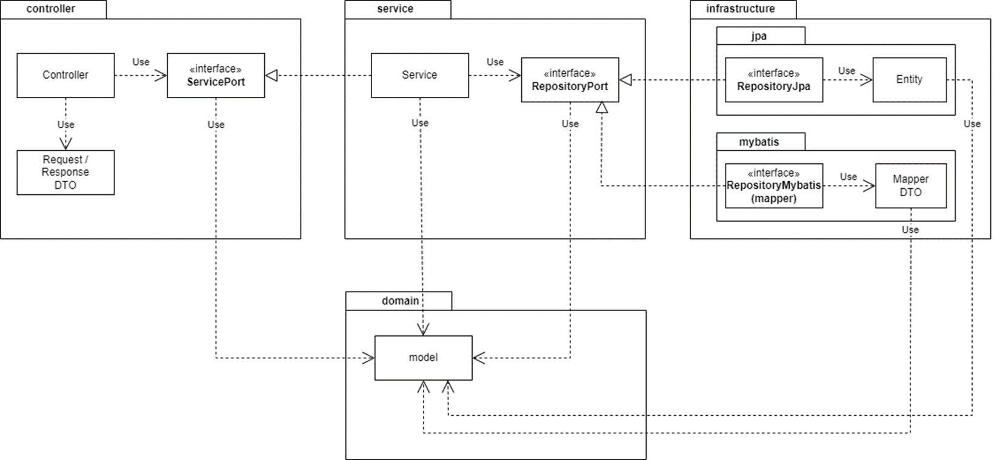

# Software Architecture Guide
> This project's design focuses on maintaining independence between layers, minimizing technical dependencies, and domain-driven design.

## Table of Contents

1. [Software Architecture Structure](#1-software-architecture-structure)
2. [Key Features of the Architecture](#2-key-features-of-the-architecture)
    - [2.1 Independence](#21-independence)
    - [2.2 Flexibility](#22-flexibility)
    - [2.3 Domain-Driven Design](#23-domain-driven-design)
    - [2.4 DTO and Object Transformation Separation](#24-dto-and-object-transformation-separation)
3. [Detailed Layer Description](#3-detailed-layer-description)
    - [3.1 Web Layer (Web Presentation Layer)](#31-web-layer-web-presentation-layer)
    - [3.2 Service Layer (Service and Business Logic Layer)](#32-service-layer-service-and-business-logic-layer)
    - [3.3 Domain Layer (Domain Model Layer)](#33-domain-layer-domain-model-layer)
    - [3.4 Infrastructure Layer (Infrastructure Technology Layer)](#34-infrastructure-layer-infrastructure-technology-layer)

---

## 1. Software Architecture Structure
The architecture can be represented as follows:

---

## 2. Key Features of the Architecture

### 2.1 **Independence**
- Web (Controller) Layer communicates only with ServicePort Interface, and Infrastructure Layer connects with RepositoryPort Interface.
- Service and Domain Layers remain unaffected by changes in data formats or request methods.
- Spring **Dependency Injection (DI)** reduces coupling between layers.

### 2.2 **Flexibility**
- Changes in implementation technologies (JPA, MyBatis, etc.) in the Infrastructure Layer do not affect upper layers (Service, Controller).

### 2.3 **Domain-Driven Design**
- Domain models (pure Java objects) are central and independent of other layers.
- This ensures that application business logic can operate independently of data storage or API specifications.

### 2.4 **DTO and Object Transformation Separation**
- DTO and object transformation layers are implemented to prevent domain objects from being modified to match external API or data storage formats.

---

## 3. Detailed Layer Description

### 3.1 **Web Layer** (Web Presentation Layer)
> The top layer that receives requests from clients.  
> Handles REST API requests and calls `ServicePort(Interface)`.  
> Changes in this layer are handled independently when endpoint design or frontend requirements change.

- **ServicePort Interface**:
    - Abstracts service implementation details.
    - Designed so that changes in Service Layer Logic do not affect Web Layer (Controller).

### 3.2 **Service Layer** (Service and Business Logic Layer)
> Performs the role of connecting Domain Logic calls and Infrastructure Layer.

- **RepositoryPort Interface**: Handles persistence technology in infrastructure
    - Abstracts implementation details of persistence technologies (JPA, MyBatis, etc.).
    - Service Layer's calling logic remains unchanged even when persistence technology changes.

### 3.3 **Domain Layer** (Domain Model Layer)
> Represents the **core rules** and domain state of the application.  
> Designed based on **pure Java objects (POJO)** and contains **business logic**.  
> Domain objects remain unchanged when relational model/technology (JPA or MyBatis) changes as they are separated from persistence technology.

- **DTO and Object Transformation**:
    - In this project, DTOs are separated by each Layer.
    - DTO <-> Domain transformations are provided as internal methods within DTOs.

### 3.4 **Infrastructure Layer** (Infrastructure Technology Layer)
> The infrastructure layer handles external communications.  
> While there are many infrastructure technologies such as messaging, email, and data access,  
> this project primarily implements data access roles.

- **Technology Selection Flexibility**:
    - Specific persistence technologies like JPA and MyBatis are implemented internally and abstracted through Repository Interface.
    - Therefore, Service Layer remains unaffected by technology changes. 