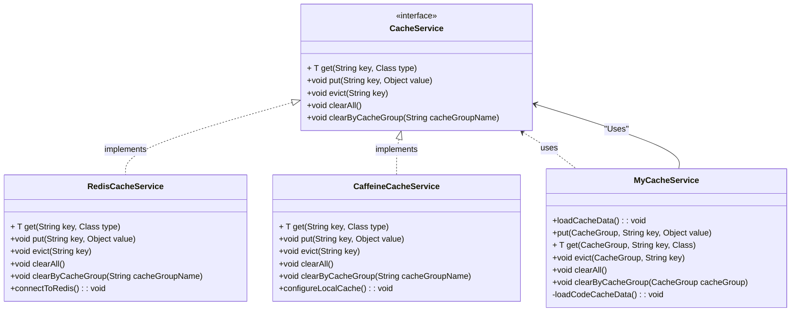

# 캐시 사용 가이드
> 캐시 기능 구현 및 활용에 대한 방향을 제공합니다.  
> 캐시 구현의 경우 프로젝트의 성격에 맞게 `캐시 기술`을 구현합니다.  
> 환경파일(yml) 설정을 활용한 캐시 유형 선택, 의존성 관리, 그리고 주요 서비스 클래스 사용법까지 다룹니다.  
> 본 예제에서는 `카페인(caffeine)` 및 `redis` 캐시를 사용하였습니다.

## 목차
1. [캐시 구성 요소](#1-캐시-구성-요소)
   - [1.1 패키지 구성](#11-패키지-구성)
   - [1.2 디렉토리 예시](#12-디렉토리-예시)
   - [1.3 CacheService Interface](#13-cacheservice-interface)
   - [1.4 커스텀 Cache Service (MyCacheService)](#14-커스텀-cache-service-myCacheservice)
       - [1.4.1 CacheGroup (enum)](#141-구성요소-cachegroup-enum)
       - [1.4.2 MyCacheService](#142-mycacheservice)
       - [1.4.3 CacheController](#143-cachecontroller)
2. [Config 설정](#2-캐시-설정-springconfig-및-applicationyml-)
   - [2.1 CacheConfig](#21-cacheconfig)
   - [2.2 application-{profile}.yml](#22-application-profileyml)
3. [캐시 사용 예제](#3-캐시-사용-예제)
4. [참고 사항 (구현체 간 관계)](#4-참고-사항-구현체-간-관계)

---

## 1. 캐시 구성 요소

### 1.1 패키지 구성
캐시 관련 기능은 다음과 같이 패키지별로 정리됩니다:

- **`skcc.arch.app.cache`**:
    - 캐시의 인터페이스를 정의하고 실제 구현할 캐시를 정의한다.   
    - CacheConfig를 통하여 의존성이 주입되도록 한다.
- **`skcc.arch.biz.common`**:
    - 프로젝트에서 사용하는 캐시 서비스를 별도로 구성하여 사용한다. 예시 MyCacheService

### 1.2 디렉토리 예시
src/    
├── skcc/arch/app/cache   
│ ├── CacheConfig.java  
│ ├── CacheService.java  
│ ├── CaffeineCacheService.java  
│ └── RedisCacheService.java  
└── skcc/arch/biz/common  
│ ├── constatns/CacheGroup.java   
│ ├── service/MyCacheService.java  
│ ├── controller/CacheController.java  
│ └── ...

### 1.3 CacheService Interface
최상위 캐시 인터페이스 아래와 같이 정의 합니다.  
구현하는 `캐시기술`에 따른 구현체는 해당 인터페이스를 상속 받아 구현합니다.  
본 가이드에서는 로컬 캐시의 `CaffeineCache`, 서버 캐시의 `RedisCache` 캐기 기술을 선택하여 구성하였습니다.
```java
public interface CacheService {
    <T> T get(String key, Class<T> type);
    void put(String key, Object value);
    void evict(String key);
    void clearAll();
    void clearByCacheGroup(String cacheGroupName);
}
```

### 1.4 커스텀 Cache Service (MyCacheService)
프로젝트 상황에 맞게 커스텀하여 캐시 서비스를 구성할 수 있습니다. 본 가이드에서는 MyCacheService를 생성하여 구성하였습니다.
`MyCacheService`의 경우 `CacheGroup` 이란 논리 그룹과 `초기적재기능`을 추가하였습니다. 

#### 1.4.1 구성요소: `CacheGroup (enum)` 
사용할 캐시그룹을 정의합니다. 캐시그룹은 반드시 정의하여 무분별한 캐시 남용을 제한 합니다.  
캐시그룹은 여러개의 캐시 키를 가질 수 있습니다.
- **사용 예제**:
    ```java
      myCacheService.get(CacheGroup.CODE, condition.getCode(), 객체 타입);
      myCacheService.put(CacheGroup.CODE, 객체);
    ```
---

#### 1.4.2 `MyCacheService` 
캐시 데이터를 `초기적재, 저장, 삭제, 초기화, 캐시네임별 초기화, 캐시 delemiter` 를 정의합니다.
구현체는 Redis 또는 Caffeine 캐시가 될 수 있습니다.

##### 주요 메서드
```java
public void loadCacheData();
public <T> T get(CacheGroup cacheGroup, String key, Class<T> clazz);
public void put(CacheGroup cacheGroup, String key, Object value);
public void evict(CacheGroup cacheGroup, String key);
public void clearAll();
public void clearByCacheGroup(CacheGroup cacheGroup);
```

##### 동작
- `loadCacheData`: 초기 적재할 캐시를 정의 합니다. (메모리 기반 캐시에서 주로 사용)
- `get`: 캐시그룹 기준으로 특정키값의 데이터를 가져옵니다. (캐시에 저장된 객체 타입과 동일해야함.)
- `put`: 캐시그룹에 해당 키와 데이터를 저장합니다.
- `evict`: 캐시그룹의 특정 키에 대한 데이터를 삭제합니다.
- `clearAll`: 캐시의 모든 데이터를 비웁니다.
- `clearByCacheGroup`: 특정 캐시그룹의 모든 데이터를 비웁니다.

##### 샘플예시
```java
@RequiredArgsConstructor
@Slf4j
public class MyCacheService {

    public static final String DELIMITER = ":";
    private final CacheService cacheService;
    private final CodeRepository codeRepository;

    @Transactional
    @EventListener(ApplicationReadyEvent.class)
    public void loadCacheData() {

        // 메모리(로컬)
        if(cacheService instanceof CaffeineCacheService) {
            // 초기 적재할 캐시
            loadCodeCacheData();
            log.info("캐시 적재 완료");
        }
        // 레디스(서버)
        else if (cacheService instanceof RedisCacheService) {
            // 초기로딩이 필요한지?
            loadCodeCacheData();
        }
    }

    /**
     * 비즈니스 요건에 맞게 캐시 설계
     * Sample - 코드 도메인의 최상위 부모만 캐시에 적재한다.
     *       CacheGroup : CacheGroup.CODE
     *       KEY: 부모의 코드값 (parentCodeId 기준)
     *       VALUE: Code 모델 (최하위 요소까지 포함)
     */
    private void loadCodeCacheData() {
        // 최상위 부모 조회
        List<Code> parent = codeRepository.findByParentCodeId(null);
        for (Code code : parent) {
            if(this.get(CacheGroup.CODE, code.getCode(), Code.class) == null)
            {
                // 최하위 까지 조회
                Code nodes = codeRepository.findAllLeafNodes(code.getId());
                this.put(CacheGroup.CODE, code.getCode(), nodes);
            }
        }
    }
}
```
---

#### 1.4.3 `CacheController` 
캐시를 관리하고 외부에서 호출할 수 있는 API를 제공하는 Cache Controller.

##### 주요 기능
1. 캐시 전체 초기화
2. 캐시그룹명 기준 전체 초기화
3. 특정 캐시그룹의 `캐시 키`를 제거한다

##### 기본 REST API 예제
```java
@RestController
@RequestMapping("/api/cache")
@RequiredArgsConstructor
public class CacheRestController {

    private final MyCacheService myCacheService;


    @GetMapping("/clear/{cacheGroupName}")
    public ApiResponse<Void> clear(@PathVariable String cacheGroupName) {
        if (StringUtils.isEmpty(cacheGroupName)) {
            myCacheService.clearAll();
        } else {
            myCacheService.clearByCacheGroup(CacheGroup.getByName(cacheGroupName));
        }
        return ApiResponse.ok(null);
    }

    @GetMapping("/evict/{cacheGroupName}/{cacheKey}")
    public ApiResponse<Void> evict(@PathVariable String cacheGroupName, @PathVariable String cacheKey) {

        CacheGroup cacheGroup = CacheGroup.getByName(cacheGroupName);
        if (cacheGroup == null) {
            return ApiResponse.fail(new CustomException(ErrorCode.NOT_FOUND_ELEMENT));
        }

        myCacheService.evict(cacheGroup, cacheKey);
        return  ApiResponse.ok(null);
    }
}
```
---

## 2. 캐시 설정 (SpringConfig 및 application.yml)  
`application.yml` 파일을 통해 `환경별`로 유연하게 캐시 기술을 성택할 수 있습니다.

### 2.1 `CacheConfig`
환경 프로퍼티 값에 지정한 `캐시 유형`에 따라 `동적으로 의존성`을 주입합니다. 
이를 위해 `@Conditional` 애너테이션과 Spring의 `@Configuration`을 활용합니다.

- **CacheConfig.java 내용**: 
    ```java
    @Configuration
    public class CacheConfig {
    
        @Bean
        @ConditionalOnProperty(name = "my.cache.type", havingValue = "caffeine")
        public CacheService caffeineCacheService() {
            return new CaffeineCacheService();
        }
    
        @Bean
        @ConditionalOnProperty(name = "my.cache.type", havingValue = "redis")
        public CacheService redisCacheService(RedisConnectionFactory connectionFactory) {
            return new RedisCacheService(getRedisTemplate(connectionFactory));
        }
    }
    ```
`@ConditionalOnProperty`: YML 설정 값에 따라 특정 Bean 활성화

### 2.2 `application-{profile}.yml`
환경별 yml 파일을 통하여 `캐시기술`을 선택 합니다.
- **application-local.yml 내용**:
    ```yaml
    cache:
      type: caffeign # 캐시 유형
      
    ```
- **application-dev.yml 내용**:
    ```yaml
    cache:
      type: redis # 캐시 유형
      
    ```
---

## 3. 캐시 사용 예제
아래 사용 예시의 경우 MyCacheService를 선언하여 사용하는 예제입니다.  
간략히 프로세스를 설명하자며 다음과 같습니다.   
`캐시조회->존재할경우 리턴, 존재하지 않을경우 DB 조회 후 캐시 추가 후 리턴`

```java

@Service
@RequiredArgsConstructor
@Slf4j
public class CodeServiceImpl implements CodeService {
    private final MyCacheService myCacheService;

    @Override
    public Code findByCode(CodeSearchCondition condition) {
        if (condition.getCode() != null) {

            // 캐시 조회
            Code cachedCode = myCacheService.get(CacheGroup.CODE, condition.getCode(), Code.class);
            if (cachedCode != null) {
                return cachedCode;
            }

            // DB 조회
            Code dbCode = codeRepository.findByCode(condition);

            // 루트 요소일 경우 캐시 추가
            if (dbCode != null && dbCode.getParentCodeId() == null) {
                myCacheService.put(CacheGroup.CODE, condition.getCode(), dbCode);
            }
            return dbCode;
        }
        return null;
    }
}
```

---

## 4. 참고 사항 (CacheService 인터페이스, 구현체, MyCacheService 관계)



