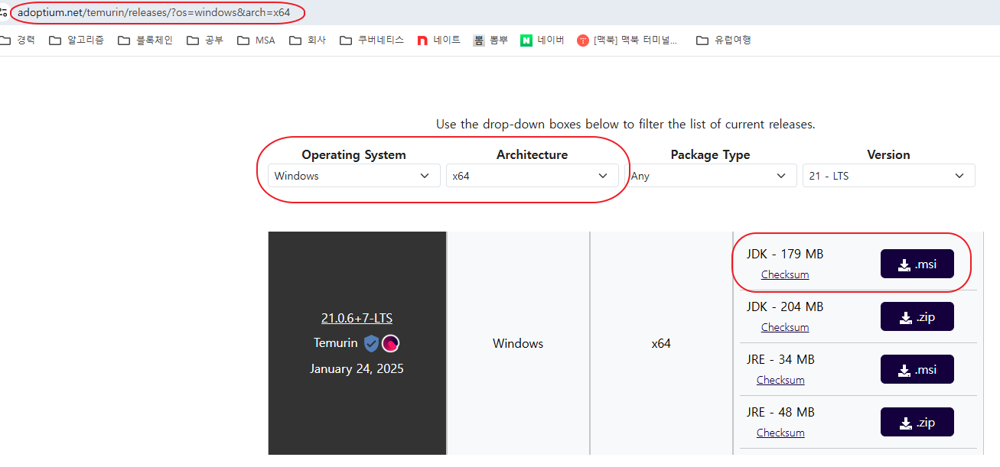
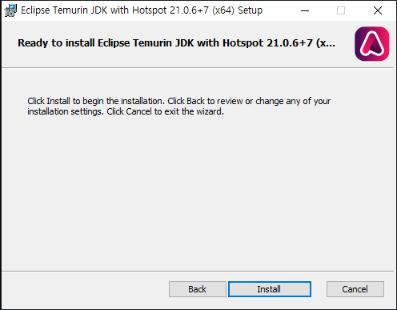
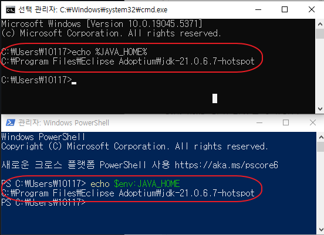
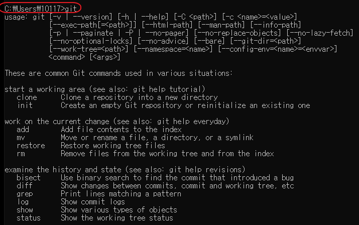
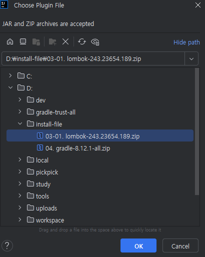
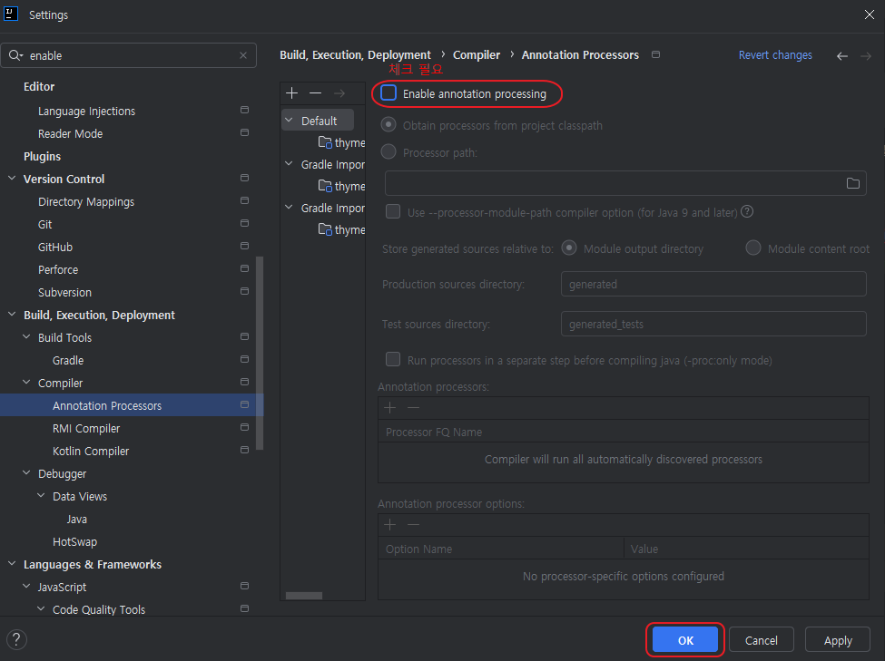
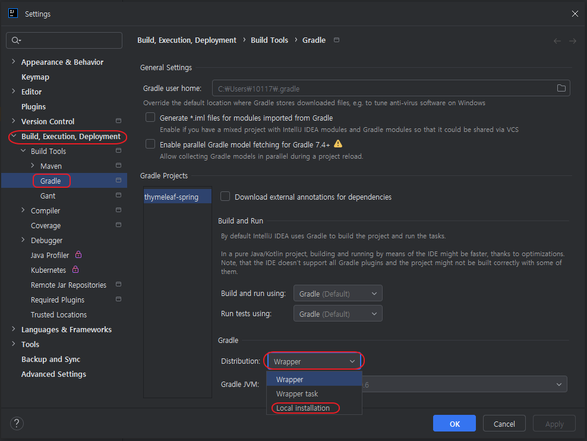
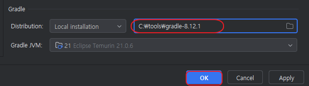

# Detailed Installation Guide

## 1. Open JDK 21
>
> Install Open JDK Eclipse Temurin version. (Other Open JDK versions are also acceptable)

### OpenJDK Download

### OpenJDK Installation
>
> Click Next button, then Install button, and finally Finish button

### OpenJDK Installation Verification and Environment Variable Setup
>
> To verify if the installation was successful, run `CMD or PowerShell` and enter `java -version` to check if version 21 is properly installed

- If the version information is not displayed correctly, manually enter it in "System Environment Variables", then restart the execution window and try again.
- System Properties -> Environment Variables -> System Variables area **Edit** -> New

- Add the `JAVA_HOME` environment variable.
- System Properties -> Environment Variables -> System Variables area **New** -> Variable name: JAVA_HOME, Variable value: JDK installation directory

- Run CMD or PowerShell to verify the changes
  - CMD: echo %JAVA_HOME%
  - PowerShell: echo $env:JAVA_HOME
  

## 2. GIT
>
> Run the Git installation program and verify that git commands work properly.

## 3. IDE (Intellij Community Version)
>
> Install Intellij Community version.
> Ultimate or other IDEs are also acceptable.

### JDK 21 Configuration
>
> When running IntelliJ, select the previously installed JDK 21 version in the JDK configuration input window.

### Manual Lombok Plugin Installation (Closed Network)
>
> For Lombok, manual installation is required in a `closed network` environment.  
> For online environments, you can install it by searching for Lombok in Plugins.

- Navigate to Plugin Settings (File-Settings or Ctrl+Alt+S) and click on the `plugins` area
- Click the gear icon in the image below, then `Install Plugin from Disk`  

- Select the Lombok plugin zip file  

### Enable Annotation Processor
>
> **Annotation Processor** provides functionality to perform specified tasks and generate or validate code at compile time using **Java Annotations**.
This feature is executed by the **Java Compiler** and typically operates during the compilation phase.  
> Main libraries using this: Lombok, QueryDSL, etc.

- **Configuration Path** (Ctrl+Alt+S)  
  `File > Settings > Build, Execution, Deployment > Compiler > Check Annotation Processors`  
  

## 4. Gradle Installation and Setup
>
> We use Gradle among various Build Tools.
> You can use the internal Wrapper Gradle, but separate installation is required in a closed network environment.

1. Create a `tools` directory in the c drive
2. Extract the Gradle installation file to the folder (c:/tools/gradle-8.12.1)

3. Specify the Gradle execution folder in the `System Environment Variables` Path
   
4. After running Intellij, go to Settings (Ctrl+Alt+S)  
   Select Build, Execution, Deployment > Build Tools > Gradle  
   Set `Distribution` to `Local Installation`, then enter the Gradle installation path
   
    