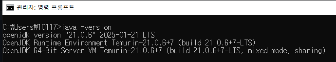
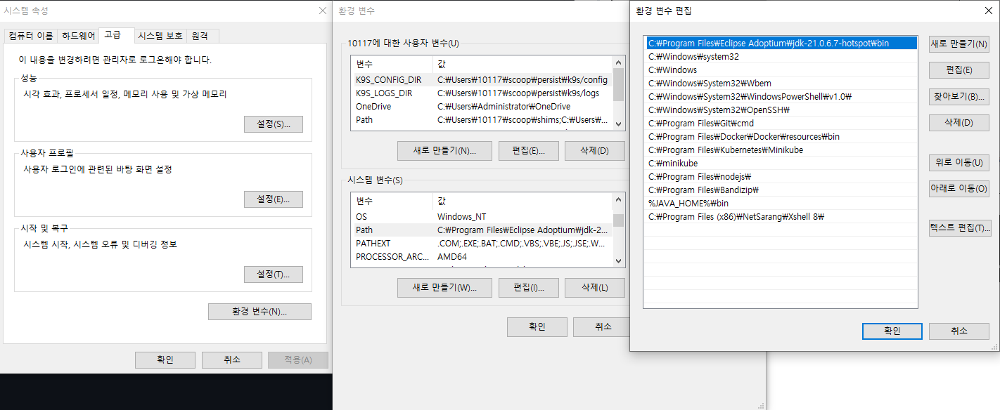
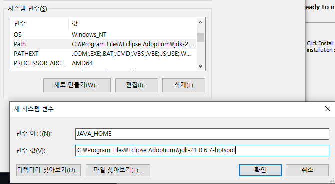
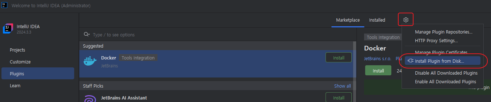
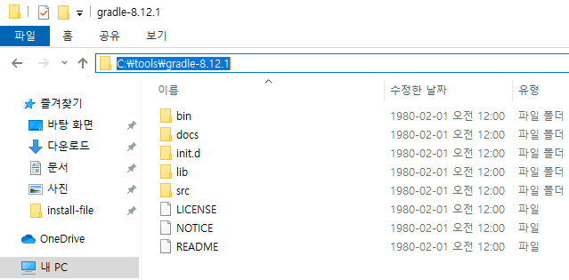
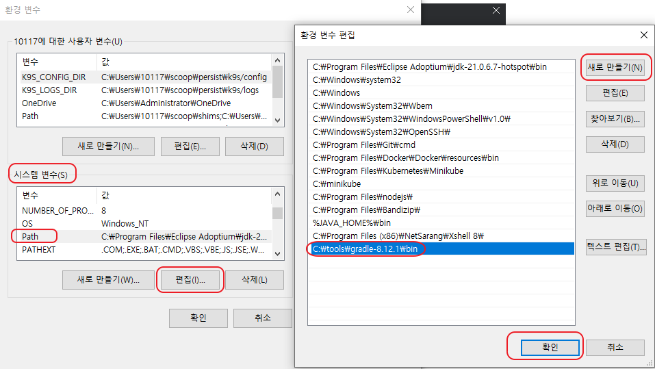

# 설치 가이드 상세

## 1. Open JDK 21
>
> Open JDK Eclipse Temurin 버전을 설치 합니다. (다른 Open JDK 를 써도 무방합니다)

### OpenJDK 다운로드

### OpenJDK 설치
>
> Next 버튼 클릭 후 Install 버튼 Finish 버튼

### OpenJDK 설치 확인 및 환경변수 추가
>
> 설치가 정상적으로 되었는지 확인하기 위해 `CMD 또는 PowerShell` 를 실행후 `java -version`을 입력하여 21 버전이 정상적으로 설치 되었는지 확인

- 만약, 버전정보가 정상적으로 보이지 않는다면 "시스템 환경변수"에 직접 입력 후, 실행 창을 재시작하고 입력한다.
- 시스템 속성 -> 환경 변수 -> 시스템 변수 영역의 **편집** -> 새로 만들기

- `JAVA_HOME` 환경 변수를 추가한다.
- 시스템 속성 -> 환경 변수 -> 시스템 변수 영역의 **새로 만들기** -> 변수이름: JAVA_HOME, 변수값: JDK 설치 디렉토리

- CMD 또는 PowerShell 실행 후 적용 되었는지 확인
  - CMD : echo %JAVA_HOME%
  - PowerShell : echo $env:JAVA_HOME
  

## 2. GIT
>
> Git 설치 프로그램을 실행 후 git 명령어가 정상 수행 되는지 확인합니다.

## 3. IDE (Intellij Community Version)
>
> Intellij Community 버전을 설치합니다.
> Ultimate 또는 다른 IDE를 사용하셔도 무방합니다.

### JDK 21 설정
>
> 인텔리제이를 실행하면 JDK 설정을 입력창에 이전에 설치한 JDK 21 버전을 선택합니다.

### Lombok Plugin 수동 설치 (폐쇄망)
>
> Lombok의 경우 `폐쇄망`의 경우 수동 설치가 필요합니다.  
> Online일 경우 Plugins 에서 Lombok 검색후 설치하시면 됩니다.

- Plugin Setting 이동 (File-Setting 또는 Ctrl+Alt+S) 하여 `plugins` 영역 클릭
- 아래 그림의 톱니 바퀴 클릭 후 `Install Plugin from Disk`  

- Lombok plugin zip 파일을 선택  

## 4. Gradle 설치 및 세팅 
>
> 여러 Build Tool 중 Gradle 을 사용합니다.
> 내부 Wrapper Gradle 을 사용해도 되지만 폐쇄망일 경우 별도 설치가 필요합니다.

1. c 드라이브에 `tools` 디렉토리 생성
2. Gradle 설치파일을 해당 폴더에 압축해제 (c:/tools/gradle-8.12.1)

3. `시스템 환경변수` Path에 Gradle 실행 폴더 지정
   
4. Intellij 실행 후 Setting 이동 (Ctrl+Alt+S)  
   Build, Execution, Deployment > Build Tools > Gradle 선택  
   `Distribution`의 `Local Installation` 설정 후, Gradle 설치 경로 입력
   
   