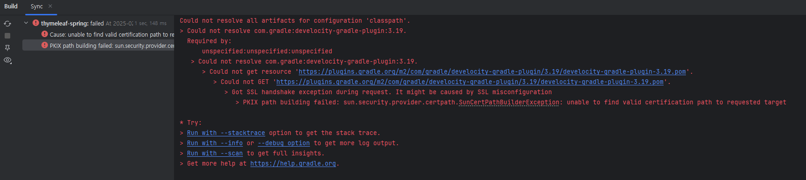
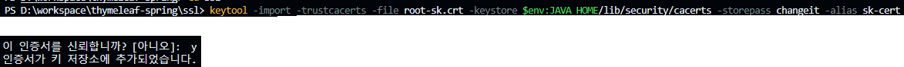
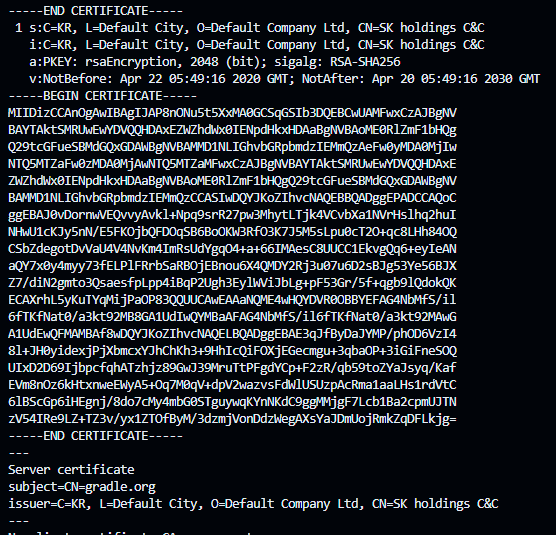

# SK 사내망 추가 설정
>
> 사내망의 경우 인터넷은 허용되지만 `*.gradle.org` 에 대한 인증서를 신뢰할 수 없다고 나옵니다.  
> 따라서, 기본 Java Home의 인증서 저장소(cacert)에 사내 ROOT 인증서를 추가해줘야 합니다.

## project gradle build 시 오류



### 해결방안
>
> SK 사내 ROOT 인증서 추가

- SK ROOT 인증서 파일 디렉토리 이동 (프로젝트의 ssl 폴더의 sk.crt 파일)
- keytool 명령어로 인증서 추가

```bash
keytool -import -trustcacerts -file '인증서파일명' -keystore $env:JAVA_HOME/lib/security/cacerts -storepass changeit -alias '인증서_별칭'
```

- 실행화면


- intellij 재시작 후 gradle build 클릭 시, 관련 jar 다운로드 됩니다.

## 참고사항

### openssl 을 통한 SK ROOT 인증서 추출

- openssl 명령어를 통하여 SSL 체인 인증서 목록을 모두 추출할 수 있습니다.

```bash
openssl s_client -connect 호스트:포트 -showcerts
# openssl s_client -connect plugins.gradle.org:443 -showcerts
```

- 위 결과값에서 SK 인증서 부분을 추출하여 CRT 파일로 만듭니다.

