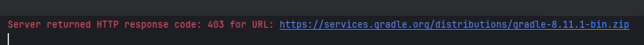
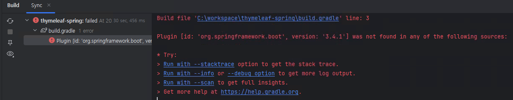

# New Tech VDI 설정
>
> New Tech VDI의 경우 외부 인터넷망이 허용되지 않으므로,  
> 사내 Repository 설정이 필요합니다.  
> 기본 설치 및 소느 다운로드는 완료되었다는 가정하에 설명합니다.  

## 프로젝트 실행 프로세스

1. `Gradle 설치 위치`를 별도로 잡지 않은 경우 아래와 같은 오류가 발생합니다. 
    
    IntelliJ Gradle 설치 경로 설정을 합니다. [링크](./9100-install-basic-guide.md#4-gradle-설치-및-세팅-)
2. Gradle 설치 경로 설정 후 아래와 같은 Gradle 빌드 오류가 발생합니다.  
   _Maven Repository 및 Plugin Portal 접속이 차단되어 관련 plugin 을 받지 못하여 발생 
   
3. `settings.gradle` 및 `build.gradle` repository 경로 수정후 gradle `refresh`
   - build.gradle (사내 Nexus service flow 용 URL 적용)
    ```groovy
    repositories {
        maven {
            url 'https://gdi-nexus.gdi.cloudzcp.net/repository/maven-sflowsla-group'
        }
        //mavenCentral()
    }
    ```
   - settings.gradle (사내 Nexus service flow 용 URL 적용)
    ```groovy
    // 폐쇄망
    pluginManagement {
     repositories {
        maven {
              url 'https://gdi-nexus.gdi.cloudzcp.net/repository/maven-sflowsla-group'
        }
     }
    }
    rootProject.name = 'thymeleaf-spring'
    ```

## 참고사항
- new Tech VDI Nexus URL: https://gdi-nexus.gdi.cloudzcp.net
- **maven central proxy 사용안한 이유**  
  **gradle plugin portal** 쪽 라이브러리(develocity-gradle-plugin:3.18.2)를 가져오지 못해 서비스플로우 넥서스에 수동 업로드하였습니다.  
- 사내 nexus maven central URL: https://gdi-nexus.gdi.cloudzcp.net/repository/maven-central  
- 추후 publish 등이 필요할 경우 nexus group 생성 필요   
